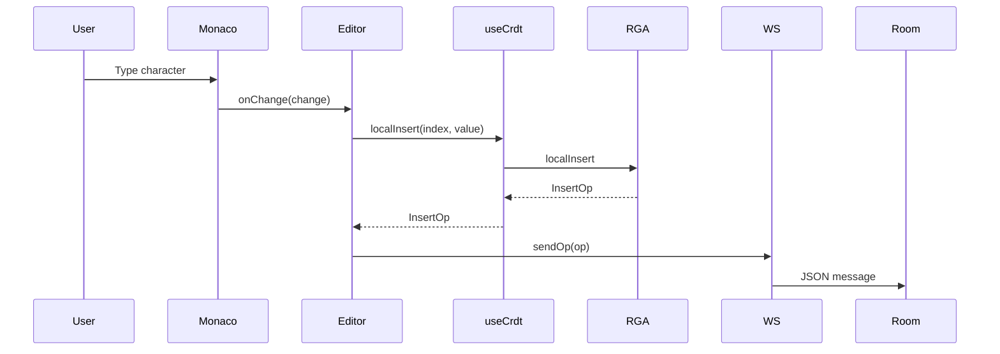
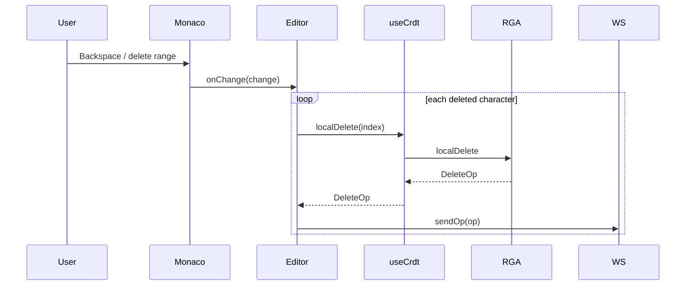
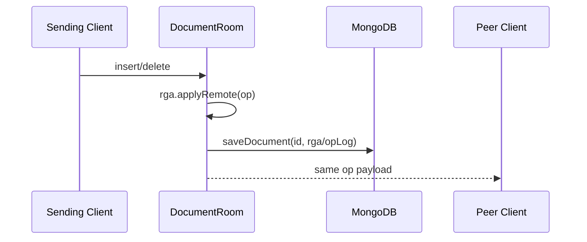
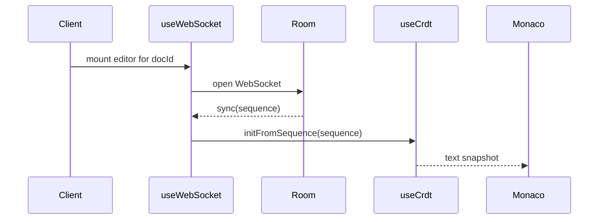

# Dataflows and Critical Runtime Paths

This document describes the operational message and persistence flows for DocSync, focused on the runtime paths that matter for correctness and observability.

## 1. Message Types

| Message | Sender | Receiver | Persisted | Purpose |
| --- | --- | --- | --- | --- |
| `insert` | client | server → peer clients | yes (document op log) | Add one character after a parent ID |
| `delete` | client | server → peer clients | yes (tombstone recorded) | Tombstone one character |
| `sync` | server | newly connected client | no (transient) | Send current full sequence snapshot |
| `cursor` | client | peer clients via server | no | Broadcast ephemeral presence / cursor position |

## 2. Local Insert Flow

Notes:
- Monaco visible index is converted into a CRDT insertion position.
- Local replica updates immediately (optimistic UI); network round-trip follows.
- Multi-character input is sent as one operation per character.

## 3. Local Delete Flow

Notes:
- Deletes are tombstones (logical deletion) rather than physical removal.
- Range deletes are emitted as repeated single-character delete operations.

## 4. Server Fan-Out Flow

Notes:
- The sending client typically does not receive its own operation back.
- Room replica is updated before persistence and broadcast complete.
- Cursor messages are forwarded but not persisted.

## 5. Join and Reconnect Flow

Notes:
- `useWebSocket` reconnects with exponential backoff.
- On reconnect the server sends a fresh `sync` snapshot for the room; client rehydrates from it.
- Initial population uses a full `setValue()`; subsequent remote updates apply incremental deltas.

## 6. Out-of-Order Dependency Resolution

Two mechanisms ensure convergence when messages arrive out-of-order.

### Insert Backlog

1. If an insert arrives before its `parentId` exists locally it is placed into `insertBacklog`.
2. No editor event is emitted until the insert is applied.
3. When the parent arrives, backlog entries are retried.

### Tombstone Cache

1. If a delete arrives before the target char exists, its `CharId` is stored in `tombstoneCache`.
2. When the matching insert later arrives, the char is created already tombstoned.
3. This avoids visible flicker.

## 7. Persistence Flow

1. Room state changes after every insert/delete.
2. The server persists operation metadata / op log and a serialized sequence into MongoDB (documents collection).
3. Writes are upserts for the room id.

Implications:
- Persistence is restart-safe; large documents increase write size because snapshots/op logs grow.

## 8. Critical Failure Boundaries

- Editor ↔ CRDT: mismatch between Monaco offsets and CRDT visible indexes leads to incorrect edits.
- CRDT ↔ WebSocket: malformed ops or missing causal IDs break convergence.
- Room ↔ Storage: failed persistence keeps state in memory but loses recent ops on restart.
- Sync Boundary: stale or partial `sync` payloads can cause a new client to diverge until corrected.

## 9. Highest-Value Observability Points

1. Time from Monaco local change → WebSocket send.
2. Time from server receive → peer broadcast.
3. MongoDB write duration and failure rate.
4. CRDT backlog size and tombstone-cache hits.
5. Room count, room size, client count per room.

---

Document maintained by the engineering team — update as architecture evolves.
